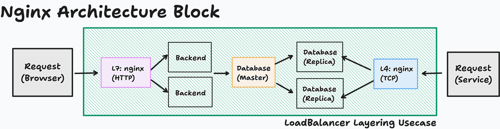

## Docker Command and Nginx Scaffolding

## Architcture of Nginx to achieve multi-tenency


```
Note: To handle both HTTP path routing (Frontend/Backend) and DNS proxying (UDP/TCP streaming), you must configure Nginx using two distinct top-level blocks: HTTP for your web application path routing and Stream for your DNS routing.
- To scale Load-balancer your using anycast. 
```

* ##### Application: 1
```app1
$ cd app1
$ docker build -t app1 .

# RUN: For expossing outer world
$ docker run -d -p 8080:80/tcp --name application1 app1

# Terminal: 
    ## Public check
        $ curl http://localhost:8080

# STOP: dismiss container
$ docker stop application1
$ docker rm -f application1
$ docker network rm app-network `for one time at the whole system`

# Else, not expossing port, using container IP (Lb doesn't required to expose)
$ docker run -d --name application1 app1

# For FQDN: initialize particular docker network
$ docker network create app-network `for one time at the whole system`
$ docker run -d --name app1 --network app-network app1
```

```docker ip app1
$ docker ps
$ docker inspect <app1-container-id>
```

* ##### Application: 2
```app2
$ cd app2
$ docker build -t app2 .

# RUN: For expossing outer world
$ docker run -d -p 8081:80/tcp --name application2 app2

# Terminal:
    ## Public check
        - curl http://localhost:8081

# STOP: dismiss container
$ docker stop application2
$ docker rm -f application2

# Else, not expossing port, using container IP (Lb doesn't required to expose)
$ docker run -d --name application2 app2

# For FQDN: initialize particular docker network
$ docker run -d --name app2 --network app-network app2
```

```docker ip app2
$ docker ps
$ docker inspect <app2-container-id> | grep IP
```


* ##### Layer-4: nginx
```lb4
$ cd lb4
$ docker build -t nginx-layer4 .

# LB requires to expose for accessing publiclly
$ docker run -d -p 80:80/tcp --name nginx-l4-proxy nginx-layer4

# Else, initialize network for accessing with FQDN facilities
$ docker run -d -p 80:80/tcp --name nginx-l4-proxy --network app-network nginx-layer4

# Terminal:
    ## Public check
        - curl http://localhost:80
```

* ##### Layer-7: nginx
```lb7
$ cd lb7
$ docker build -t nginx-layer7 .

# LB requires to expose for accessing publiclly
$ docker run -d -p 80:80/tcp --name nginx-l7-proxy nginx-layer7

# Else, initialize network for accessing with FQDN facilities
$ docker run -d -p 80:80/tcp --name nginx-l7-proxy --network app-network nginx-layer7

# Terminal:
    ## Public check
        - curl http://localhost:80
```

* ##### Loadbalancer: nginx (L4 & L7)
```lb
$ cd lb
$ docker build -t nginx-loadbalancer .

# LB requires to expose for accessing publiclly
$ docker run -d -p 80:80 --name nginx-loadbalancer-webserver nginx-loadbalancer

OR

$ docker run -d -p 3304:3304 --name nginx-loadbalancer-webserver nginx-loadbalancer

# Else, initialize network for accessing with FQDN facilities
$ docker run -d -p 80:80 -p 3304:3304 --name nginx-loadbalancer-webserver --network app-network nginx-loadbalancer

# LoadBalancer (TCP & HTTP): Domain inclusion (alternative of domain provider) - achieving multitenency
$ cd /
$ cat etc/hosts
$ sudo nano /etc/hosts
- add server name in hostname: (remove once test done)
    127.0.0.1       app1.loadbalancer.com
    127.0.0.1       app2.loadbalancer.com

# Terminal:
    ## Public check
      # L7
        - curl http://localhost:80
        - curl http://localhost:80/api/app1
        - curl http://localhost:80/api/app2
        - curl http://app1.loadbalancer.com
        - curl http://app2.loadbalancer.com
      # L$
        - curl http://localhost:3304
```

#### Run all services with Docker Compose

From the project root:

```bash
# TO RUN:
docker compose up -d --build

## CHECK RUN:
curl http://localhost:8084 # Layer 4 load balancer
curl http://localhost:8087 # Layer 7 load balancer

curl http://localhost:80 # Layer 7 load balancer
curl http://localhost:3304 # Layer 4 load balancer
docker compose logs lb4 lb7 lb

# TO STOP:
docker compose down
```

Both load balancers forward to `app1:80` and `app2:80` on the shared
Compose network, with weights 5 and 3. The apps are only exposed internally with Fully Qualified Domain Name.
Different host ports let both load balancers run together.

The load balancer configs now use Compose service names. The standalone
`docker run` examples above require a shared user-defined network with backend
aliases `app1` and `app2`, or configs updated with reachable backend addresses.
If you recreate either app independently, restart the load balancers with
`docker compose restart lb4 lb7 lb` to refresh their resolved backend addresses.
